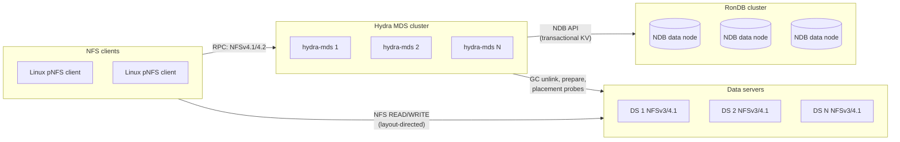
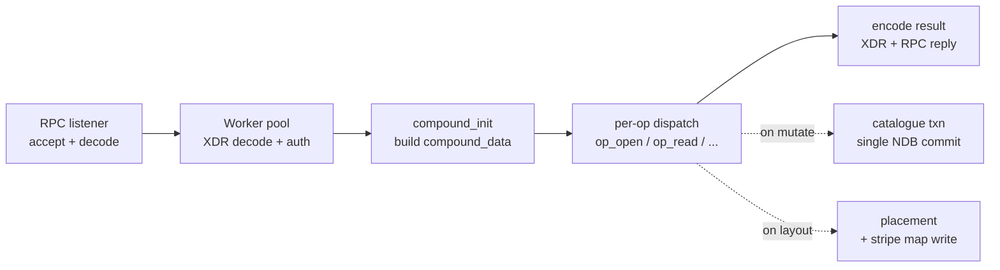

# Hydra Architecture
Hydra is a parallel NFS (pNFS, RFC 8881 / RFC 7862) metadata server.  It speaks
NFSv4.1 and NFSv4.2 to clients on the front end and routes bulk file I/O around
itself by handing clients a layout that points at one or more data servers
(DSes).  The metadata is kept in a transactional, shared-nothing key-value
store (RonDB / NDB) so that several Hydra daemons can serve the same namespace
simultaneously without a coordinator.
This document describes the architecture as it stands in the source tree.  It
is intended for contributors and operators who need to understand how the
pieces fit together before touching code.
## 1. Goals and non-goals
### Goals
- **Active-active metadata.**  Any number of Hydra daemons can serve the same
  filesystem at the same time.  There is no leader, no global lock service,
  and no fail-over event between daemons.
- **Out-of-band data.**  Clients never read or write file payload through the
  MDS.  The MDS only mints layouts; the data path is client → DS over NFSv3
  (flex-files) or NFSv4.1 file layout.
- **Correctness over throughput.**  Every namespace mutation is a single
  transactional operation in the catalogue.  Concurrent OPEN, CREATE, RENAME,
  REMOVE, LINK between daemons cannot lose updates or produce torn reads.
- **Operability on commodity hardware.**  No special kernel modules, no
  custom hardware, no kernel patches.  RonDB and the standard Linux NFS
  stack are sufficient.
### Non-goals
- **Embedded local metadata.**  Hydra does not store authoritative metadata
  on local disk.  Stateless on restart; the catalogue is the source of truth.
- **Block storage / direct-attached striping.**  Hydra is a metadata service.
  Stripe placement is calculated by the MDS but the actual blocks live on
  data servers that present a regular file-per-stripe interface.
- **Cross-cluster replication / DR.**  A single Hydra deployment is one
  RonDB cluster.  Cross-cluster replication is delegated to RonDB's own
  binlog tooling and is out of Hydra's scope.
## 2. System view

A request flows like this:
1. Client mounts the export and walks the namespace via LOOKUP / GETATTR.
2. On OPEN, the MDS returns a stateid; on the immediate LAYOUTGET it returns
   a flex-files or file layout pointing at one or more DSes.
3. Client sends NFS READ / WRITE directly to those DSes.
4. On CLOSE, LAYOUTRETURN releases the layout state.
The MDS never sees data bytes during the steady state.  The MDS does see
COMMITs and SETATTR(size=...) which it persists to the catalogue.
## 3. Process model
A single Hydra binary (`hydra-mds`, `src/mds/main.c`) runs as one Linux
process per node.  Inside that process there is no fork: every subsystem is
threads sharing one address space.
| Thread group | Source | Role |
|---|---|---|
| RPC listeners | `src/mds/rpc_server.c` | One per configured listen socket; accepts RPC connections, decodes NFSv4 COMPOUND, hands work to the worker pool. |
| Compound workers | `src/mds/rpc_server.c`, `compound.c` | Pool that runs `compound_process()` end-to-end for one COMPOUND request. |
| Catalogue I/O threads | `src/catalogue/catalogue_rondb_shim.cpp` | Bound to NDB cluster connections; drive transactions on behalf of compound workers. |
| Commit queue | `src/mds/commit_queue.c` | Optional batched-write path that coalesces small NDB writes (inline data, dirent updates) into larger transactions. |
| Layout recall | `src/mds/layout_recall.c` | CB_LAYOUTRECALL deliveries on the back-channel. |
| DS GC | `src/mds/ds_gc.c` | Coordinator + worker pool; drains the GC queue (orphan stripe rows from final-unlink) and issues NFS UNLINK to the DSes. |
| DS pre-allocator | `src/mds/ds_prealloc.c` | Refills a small per-DS lookahead pool of stripe coordinates so OPEN(create)+LAYOUTGET hits no NDB pre-write. |
| DS health | `src/mds/ds_health.c` | Periodic NFS NULL probe + LAYOUTERROR aggregation; feeds placement. |
| Cluster transport | `src/cluster/cluster_transport.c` | gRPC peer messaging for cross-MDS cache invalidation, hard-link 2PC, etc. |
| Sessions / DRC | `src/mds/session.c` | NFSv4.1 session table, slot tables, replay cache. |
| Backchannel | `src/mds/nfs4_cb.c` | CB_COMPOUND encoder + transport for CB_RECALL, CB_LAYOUTRECALL, CB_NOTIFY. |
| Metrics | `src/mds/metrics_http.c` | HTTP `/metrics` endpoint (Prometheus text format). |
The worker pool is sized by `worker_threads` (config); the listener pool by
`listener_threads`.  All other threads are singletons or small fixed pools.
## 4. Source layout
```text path=null start=null
src/
├── mds/         # NFSv4.1/4.2 protocol surface and per-op handlers
├── catalogue/   # Pluggable metadata backend (RonDB, in-memory test stub)
├── cluster/     # Cross-MDS coordination (transport, membership, 2PC)
├── common/      # Shared utilities: config, fh codec, endian helpers
├── fsal_obj/    # FSAL-style object abstractions used by the MDS
├── tools/       # CLI tools (admin, dump, replay, etc.)
└── bpf/         # Optional eBPF tracepoints for observability
include/         # Public-facing headers; one per logical subsystem
proto/           # gRPC service definitions for cluster transport
tests/
├── unit/        # Per-module C unit tests
└── integration/ # End-to-end tests against a memdb catalogue
```
The boundary between `mds/` and the rest is intentional.  `mds/` knows about
NFSv4 ops; everything below is protocol-agnostic and could in principle be
reused by a different front end.
## 5. Compound processing
Every NFSv4.1/4.2 client request is a COMPOUND containing one or more ops.
The processing pipeline is:

### `compound_data`
A short-lived per-request struct (`include/compound.h`) that holds:
- The current and saved file handles (FH).
- A small inline cache of the inode for current/saved FH (so a sequence
  PUTFH+GETATTR doesn't re-read the catalogue).
- Pointers to the long-lived subsystem handles: catalogue, sessions,
  open-state table, lock table, delegation tables, caches, quota, shard
  map, subtree map, cluster transport.
- Caller credentials (AUTH_SYS uid/gid + supplementary GIDs).
- A per-request notion of "current shard" used by sharded deployments.
The struct is rebuilt fresh per COMPOUND.  Any state that must outlive a
compound lives in one of the long-lived subsystems it points at.
### Per-op dispatch
Op handlers are split across files by topic:
- `compound_namespace.c` — ACCESS, PUTFH/PUTROOTFH/SAVEFH/RESTOREFH/GETFH,
  LOOKUP/LOOKUPP, GETATTR/SETATTR, CREATE/REMOVE/RENAME/LINK, READDIR,
  READLINK.
- `compound_data_io.c` — OPEN/CLOSE, READ/WRITE, IO_ADVISE, COMMIT, the
  delegation grant point, and inline-data promotion.
- `compound_layout.c` — LAYOUTGET, LAYOUTCOMMIT, LAYOUTRETURN,
  GETDEVICEINFO, LAYOUTERROR, LAYOUTSTATS.
- `compound_session.c` — EXCHANGE_ID, CREATE_SESSION, SEQUENCE,
  DESTROY_SESSION, BIND_CONN_TO_SESSION, RECLAIM_COMPLETE.
- `compound_nfsv42.c` — ALLOCATE, DEALLOCATE, COPY/COPY_NOTIFY/CLONE/SEEK,
  xattr ops.
- `compound.c` — top-level dispatcher and helpers (`compound_process`,
  `compound_inode_get`, snapshot invalidation).
Each op returns an `enum nfs4_status`; the encoder (`xdr_codec.c`) turns the
result union into a wire reply.
## 6. Catalogue (metadata backend)
Hydra abstracts its metadata store behind a small C ABI in
`include/mds_catalogue.h`.  Two backends ship in tree:
- **RonDB / NDB** (production) — `src/catalogue/catalogue_rondb_shim.cpp`
  wraps the NDB C++ API behind a narrow C surface.  The shim opens NDB
  cluster connections, manages a per-thread `Ndb` object, and exposes a
  one-call-one-transaction interface to the rest of Hydra.
- **memdb** (tests) — `src/catalogue/catalogue_memdb.c` is an in-memory
  hash-table backend used by the unit tests so the suite has no external
  dependency.
Both backends implement the same vtable (`include/catalogue_internal.h`).
Tables (logical, not literal NDB DDL):
| Table | Purpose |
|---|---|
| `inodes` | Per-inode attributes (mode, owner, size, change, parent_fileid). |
| `dirents` | Parent-fileid + name → child fileid + type. |
| `stripe_maps` | Per-file layout: stripe count, mirror count, ordered (ds_id, FH) list. |
| `inline_data` | Small-file payload + symlink targets. |
| `xattrs` | RFC 8276 user xattrs. |
| `gc_queue` | Orphan stripes scheduled for DS-side cleanup. |
| `delegations` (optional) | Persisted file delegations for cross-MDS visibility. |
| `layouts` (optional) | Persisted layout state for cross-MDS visibility. |
| `coord_*` | Cross-MDS coordination state (subtree ownership, fencing). |
### Atomicity contract
Every mutating MDS op compiles down to **one NDB transaction**.  Examples:
- `mkdir`, `rmdir`, `link`, `rename` use NDB `interpretedUpdateTuple`
  (`incValue` / `subValue`) to update the parent's `nlink`, `mtime`, `ctime`,
  and `change` counter atomically with the dirent insert / delete.  No
  read-modify-write race even when several MDS daemons mutate the same
  parent directory concurrently.
- `setattr` takes an exclusive row lock, reads the current inode, merges
  the requested attribute mask, and writes back in a single transaction.
- `rename` (including the same-cluster cross-subtree case) is one
  transaction in `rondb_shim_rename`: delete src dirent, write dst dirent,
  interpreted parent updates, and child `parent_fileid` change all commit
  atomically.
### Cross-MDS coordination
For a small set of operations that span more than one logical row group
across shards or MDSes, Hydra layers a higher-level protocol on top of the
catalogue:
- `src/cluster/rename_2pc.c` — cross-shard rename when the deployment is
  sharded (the single-RonDB-cluster case collapses into one NDB txn; this
  module exists for multi-cluster topologies).
- `src/cluster/hardlink_2pc.c` — cross-subtree hard link (target inode and
  link directory in different shards).  Disabled by default until the
  surrounding plumbing is complete.
## 7. pNFS layout path
Hydra serves two pNFS layout types:
- **Flex-files** (default) — DS endpoints are NFSv3, one file per stripe.
- **NFSv4.1 file layout** — DS endpoints are NFSv4.1.
Both share the same in-MDS pipeline:
1. **OPEN(create)**.  `op_open` calls `cat_create()`, which allocates a
   fileid, writes the dirent and inode, and (when the pre-allocator is on)
   pulls a stripe coordinate from a per-DS lookahead pool so the layout is
   ready before LAYOUTGET arrives.
2. **LAYOUTGET**.  `op_layoutget` either reuses the pre-grant from OPEN or
   computes placement via `placement_select_ex()` (`src/mds/placement.c`)
   against the active `mds_shard_map` / `ds_health_monitor` view.  The
   resulting stripe map is persisted to the `stripe_maps` table; the layout
   stateid is minted by `layout_state.c` and returned to the client.
3. **Client I/O**.  Client opens the DSes named in the layout and reads or
   writes directly.  The MDS sees nothing.
4. **LAYOUTCOMMIT**.  Client tells the MDS the new file size and mtime; the
   MDS updates the inode in one transaction.
5. **LAYOUTRETURN** / **CB_LAYOUTRECALL**.  Either side can drop the layout.
   Recalls are sent on the NFSv4.1 back-channel via `nfs4_cb_layoutrecall`.
The DS pre-allocator (`ds_prealloc.c`) and ds_cache (`ds_cache.c`) exist to
cut the LAYOUTGET fast path to a single in-memory lookup; on cache miss the
fallback is a normal catalogue read.
### Final-unlink GC
When `op_remove` drops the last link of a regular file
(`compound_namespace.c` → `enqueue_gc_for_final_unlink`), the MDS:
1. Reads the file's stripe map.
2. Enqueues one row in `gc_queue` per unique DS in the map (the worker
   later sweeps stripe/mirror coordinates within each DS).
3. Drops the stripe-map row.
4. Frees any in-memory delegation grants for the now-gone file
   (`deleg_revoke_file`).
The DS GC subsystem (`ds_gc.c`) drains the queue with a coordinator + worker
pool: the coordinator batches rows out of `gc_queue` via
`mds_cat_gc_peek_batch`, hands them to N workers that issue NFS UNLINK to
the DSes, and then deletes the queue row on success.  Transient errors put
the row back in the queue with a back-off; permanent errors flag it and
move on.
## 8. Concurrency and consistency
### State partitioning
- **Catalogue rows** — authoritative.  Concurrent writers are serialised by
  NDB's per-row locking and the single-transaction-per-mutation contract.
- **Per-MDS in-memory state** — hot caches (inode, dirent, ds), open-state
  table, lock table, delegation tables, session table.  Cross-MDS
  visibility for the parts that need it (delegations, sessions, layout
  state) is achieved by also persisting to RonDB; the in-memory copy is a
  fast path keyed by the canonical row.
- **Cross-MDS invalidation** — best-effort, over the cluster transport.
  Caches are tolerant of staleness because every fast-path read validates
  against the catalogue's `change` counter or row generation.
### Locking primitives
- **Striped mutexes.**  16-stripe `pthread_mutex_t` arrays are the default
  pattern (`open_state`, `delegation`, `lock_state`).  Hash on the natural
  key (clientid, fileid) selects the stripe.
- **NDB exclusive row locks.**  Used for `setattr` and a handful of other
  read-modify-write paths that must serialise with concurrent MDSes.
- **Read-mostly hot configs** — `_Atomic` pointers + RCU-style swap on
  reload for the shard map and DS table.  No explicit reader lock.
### Compound-internal snapshot caching
Within a single COMPOUND, an inode is read at most once per fileid.
`compound_inode_get` first checks `cd->current_inode` / `cd->saved_inode`,
then the global `inode_cache`, then the catalogue.  Mutations within the
same compound invalidate via `compound_inode_invalidate`.  This is what
keeps `PUTFH+GETATTR` to a single NDB read.
### Lease and recovery
NFSv4.1 leases are tracked per-client in `session.c`.  Lease expiry runs a
janitor that:
- Calls `deleg_revoke_client` to drop in-memory delegation grants.
- Schedules `open_state_revoke_client` to clean up locks and opens.
- Removes session/connection entries.
Grace mode (`grace.c`) prevents non-reclaim opens during the configured
grace window after daemon start.
## 9. Networking and security
### Front-channel
- ONC-RPC over TCP, NFSv4.1 minor version 1 and 2.
- Auth: AUTH_SYS, AUTH_NULL.  RPCSEC_GSS (krb5/krb5i/krb5p) is gated on the
  `mds_gss` build option.
- TLS: `mds_tls.c` provides per-listener TLS; configurable per export.
### Back-channel
NFSv4.1 sessions carry an explicit back-channel.  Hydra uses it for:
- `CB_RECALL` of file delegations.
- `CB_LAYOUTRECALL` of pNFS layouts.
- `CB_NOTIFY` for directory delegations (RFC 8881 §10.6).
The back-channel transport is implemented in `nfs4_cb.c` with the same XDR
codec used for the fore-channel.
### Inter-MDS
gRPC over TCP for the cluster transport (`src/cluster/cluster_transport.c`,
`proto/`).  Used for:
- Subtree map / membership change notifications.
- Best-effort cross-MDS cache invalidation.
- The 2PC paths (`rename_2pc`, `hardlink_2pc`) that may live alongside
  multi-cluster deployments.
## 10. Observability
- **Metrics.**  Prometheus text format on a configurable HTTP endpoint
  (`metrics_http.c`).  Counters cover NFS op rates, catalogue txn rates,
  placement decisions, GC backlog, layout error counts, branch-level
  latency histograms.
- **Structured logs.**  Journald via systemd by default; one line per
  significant event (recall, revoke, deadlock-class NDB error, GC error).
- **Optional eBPF tracepoints.**  `src/bpf/` ships a minimal set of USDT
  probes for compound-op latency and catalogue txn timing.
- **Soak harness.**  `scripts/pnfs-lab` drives a multi-host build + deploy +
  smoke + soak workflow against a lab fleet for regression testing.
## 11. Build and test
- **Build.**  CMake-based; `cmake -S . -B build && cmake --build build`.
  The RonDB backend is gated by `-DHAVE_RONDB=ON` and links against
  `libndbclient`.
- **Unit tests.**  `tests/unit/` against the memdb backend; one binary per
  module.  No external services required.
- **Integration tests.**  `tests/integration/` exercises multi-component
  flows still against memdb.
- **QA gates.**  `scripts/qa-check.sh --quick` runs style, gcc + clang
  builds, cppcheck, clang-tidy, and unit tests.  The full mode adds
  Valgrind and the integration suite.
- **Smoke.**  `scripts/pnfs-smoke.sh` runs a 17-step real-NFS smoke against
  a deployed lab.
- **Soak.**  `tests/soak/pnfs-soak.sh` produces an iter / pass / fail log
  consumed by `pnfs-soak-report.sh` for trend analysis (RSS slope, error
  rate, GC backlog).
## 12. Configuration model
Hydra reads a single INI file (default `/etc/hydra-mds/mds.conf`).  Keys are
namespaced by subsystem; the canonical reference is `man hydra-mds.conf`
(`docs/man/`).  Important groups:
- `[server]` — listen addresses, worker counts, lease time.
- `[catalogue]` — backend selection, NDB connection string.
- `[cluster]` — MDS id, peer list, subtree map source.
- `[ds]` — DS endpoints, health probe cadence, pre-allocator pool sizes.
- `[gc]` — `ds_gc_workers`, `ds_gc_batch_size`, retry policy.
- `[delegations]` — file and directory delegation toggles, transient mode.
- `[security]` — TLS / GSS settings.
All keys have safe defaults; a minimal config can be a half-dozen lines.
## 13. Limits and known constraints
- One RonDB cluster per Hydra deployment.  Multi-cluster federation is
  out of scope for the core; the 2PC modules exist as building blocks but
  are not exposed as a supported configuration.
- Maximum stripe count and mirror count are fixed at compile time by
  `MDS_MAX_STRIPES` and `MDS_MAX_MIRRORS`.  The defaults are sized for the
  flex-files target.
- Directory delegations are off by default.  Enabling them requires the
  shared-attr backend to be on so recall propagation works across MDSes.
- The hard-link 2PC path is feature-gated and not exercised in production
  deployments.  Cross-subtree LINK returns `NFS4ERR_XDEV` until the
  surrounding work is complete.
## 14. Where to start reading
- **A new COMPOUND op handler.**  `src/mds/compound.c` for dispatch, then
  the topic file (`compound_namespace.c`, `compound_data_io.c`, etc.) and
  one of the existing handlers as a template.  Add the op to the XDR codec
  in `src/common/xdr_codec.c` and the result union in `include/compound.h`.
- **A new catalogue table.**  Add a vtable entry in
  `include/catalogue_internal.h`, implement it for memdb (test path) and
  RonDB shim, expose a typed wrapper in `include/mds_catalogue.h`, and add
  a unit test against memdb.
- **A new background subsystem.**  Mirror `ds_gc.c`: a coordinator + worker
  pool, a stop-pipe + condvar shutdown sequence, INI keys with documented
  defaults in the man page, and a unit test driving the memdb backend.
- **A new pNFS layout type.**  Extend `layout_types.h`, teach
  `compound_layout.c` to mint and return the new layout, and provide a
  device-info encoder in `xdr_codec.c`.
## 15. HPC-Shared file mode (N-to-1 wide stripe)
Hydra ships an opt-in per-inode mode for the N-to-1 HPC workload
pattern (many compute clients writing into the same file at
distinct byte ranges).  When the `MDS_IFLAG_HPC_SHARED` bit is set,
LAYOUTGET emits a wide stripe geometry, prefers RDMA / GPUDirect DSes
for placement, and (in deferred phases) bypasses the per-client
layout grant and aggregates LAYOUTCOMMITs.
Files without the bit set continue to use the legacy paths
bit-for-bit unchanged.  Operator-facing surface — triggers, tunables,
deferred phases, caveats — is in `hpc-shared-files.md`.  The full
phase plan and design rationale is in `hpc-nto1-plan.md`.
